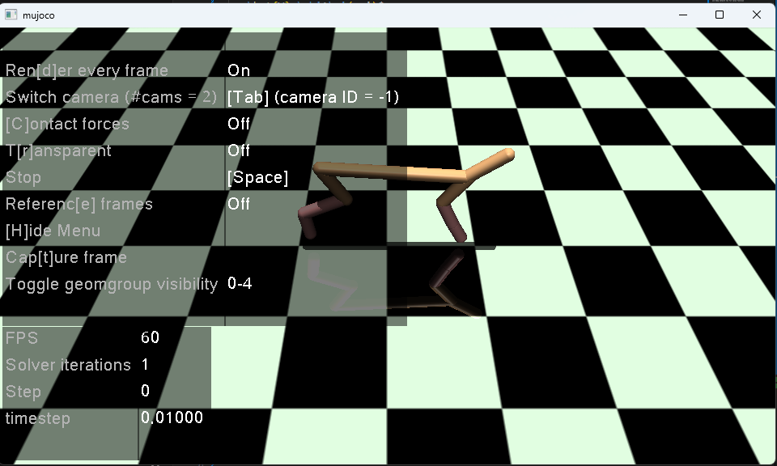
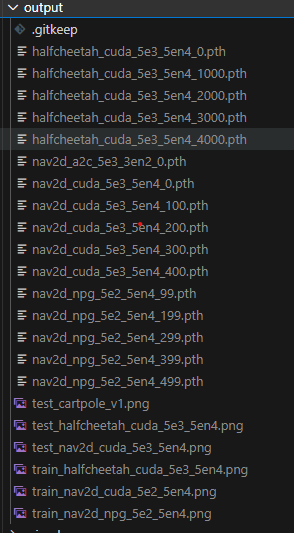
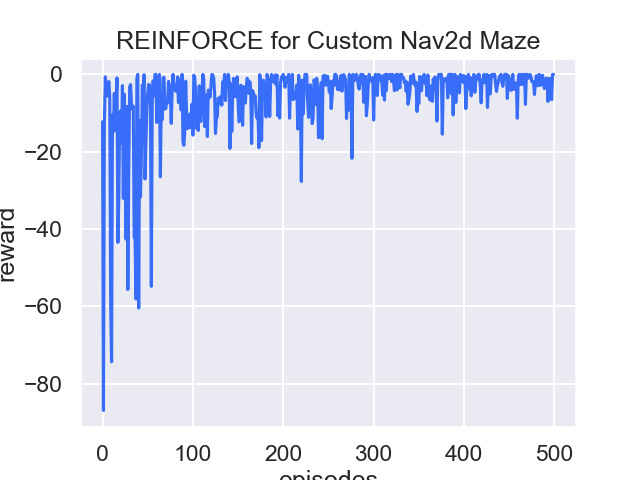
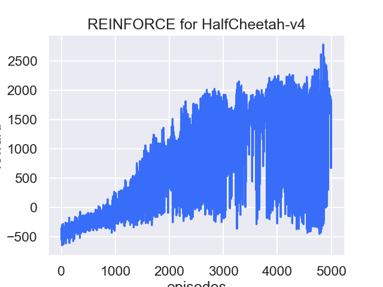
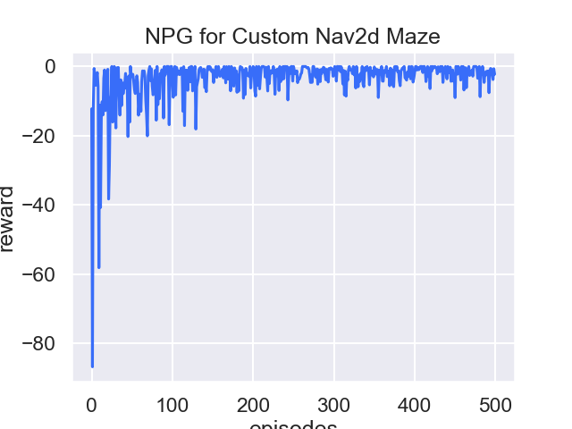

# Homework 1: Use Policy Gradient to implement the 

- 姓名：朱子航
- 学号: 522022150087
- 邮箱：522022150087@smail.nju.edu.cn

## Problem

Implement Gradient Policy Algorithm in Problem 1 and 2
- Problem 1: the point maze navigation, continuous state-action space 
- Problem 2: the MuJoCo HalfCheet, and make the robot run away
- implement Vanilla Gradient Policy and Natural Gradient Policy, recommend to use TRPO and PPO

## Introduction

Deep Reinforcement Learning is the method using Deep Neural Network to simulate the unstructured function within classic RL. Policy Gradient is a method that optimize the policy function $\pi(a,s)$ directly.

### Policy Gradient

The goal of reinforcement learning 

$p_{\theta}(\tau)=p_{\theta}(s_1,a_1,\dots, s_T,a_T)=p(s_1)\prod_{t=1}^T\pi_{\theta}(a_t,s_t)p(s_{t+1}|s_t,a_t)$

$\theta^{*}=argmax_{\theta}E_{\tau\sim p_\theta(\tau)}[\Sigma_t r(s_t, a_t)]$

$\tau$ means a trajectory，our goal is to make the expectation of reward maximize, but we have no idea what the reward may be. So we can use "Sampling" method, replay for multiple times and evaluate the expectation of reward according to the sample's reward.

e.g. replay N times

$J(\theta)=E_{\tau\sim p_{\theta}(\tau)}[\Sigma_t{r(s_t,a_t)}]\approx \frac{1}{N}\Sigma_{i=1}^N\Sigma_t r(s_{i,t},a_{i,t})$

direct policy differentiation

$J(\theta)=\int p_\theta(\tau)r(\tau)d\tau$

given $r_{\tau}=\Sigma_{t=1}^T r(s_t,a_t)$ is constant for $\theta$

$\nabla_{\theta}J(\theta)=\int\nabla_{\theta}p_{\theta}(\tau)r(\tau)d\tau=\int p_{\theta}(\tau)\nabla_{\theta}\log{p_{\theta}(\tau)}r(\tau)d\tau=E_{\tau\sim p_{\theta}(\tau)}[\nabla_{\theta}\log{p_\theta(\tau)r(\tau)}]$

Then we want to calculate $\log{p_\theta(\tau)}$

given $p_{\theta}(\tau)=p(s_1)\prod_{t=1}^T\pi_{\theta}(a_t|s_t)p(s_{t+1}|s_t,a_t)$

Then the log could convert the prod to sum

$\log{p_{\theta}(\tau)} = \log{p(s_1)}+\Sigma_{t=1}^T\log{\pi_\theta(a_t|s_t)+\log{p(s_{t+1}|s_t,a_t)}}$

now we may find that, the $\log{p(s_1)}$ and $\log{p(s_{t+1}|s_t,a_t)}$ is independent on $\theta$, so now we can transform 

$\nabla_{\theta}J(\theta)=E_{\tau\sim p_{\theta}(\tau)}[(\Sigma_{t=1}^T\nabla_{\theta} \log{\pi_{\theta}(a_t|s_t)})(\Sigma_{t=1}^T r(s_t,a_t))]$

Evaluate the policy gradient

recall we have the approximation 

$J(\theta)\approx \frac{1}{N}\Sigma_i\Sigma_t r(s_{i,t},a_{i,t})$

Thus we can approximate the gradient 

$\nabla_\theta J(\theta) \approx \frac{1}{N}\Sigma_{i=1}^N(\Sigma_{t=1}^T\nabla_\theta\log{\pi_{\theta}(a_{i,t}|s_{i,t})})(\Sigma_{t}r(s_t, a_t))$

Then $\theta = \theta + \alpha \nabla_{\theta}J(\theta)$

REINFORCE algorithm

- sample $\{\tau^i\}$ from $\pi_{\theta}(a_t, s_t)$ (run the policy)
- $\nabla_{\theta}J(\theta)\approx \Sigma_i((\Sigma_t \nabla_\theta \log{\pi_\theta(a_t^i,s_t^i)})(\Sigma_t r(s_t^i,a_t^i)))$
- $\theta\leftarrow \theta + \alpha\nabla_\theta J(\theta)$

What is $\Sigma_t \nabla_\theta \log{\pi_\theta(a_{i,t},s_{i,t})}$?

Comparison to maximum likelihood

$\pi_\theta(a_t|s_t)$ could be something like neural network

Exmaple: Gaussian Policies

A neural network output the mean of distribution of policy

$\pi_{\theta}(a_t|s_t)=\mathcal{N}(f_{nn}(s_t);\Sigma)$

$\log{\pi_\theta(a_t|s_t)}=-\frac{1}{2}|f(s_t)-a_t|_{\Sigma}^2+ const$

$\nabla_{\theta}\log{\pi_\theta(a_t|s_t)}=-\frac{1}{2}\Sigma^{-1}(f(s_t)-a_t)\frac{df}{d\theta}$

But we may see, that the $\alpha$ is hard to set for vanilla policy gradient and the matrix is prone to ill-cases and hard to solve. Thus, we will introduce Natural Gradient Method.

### Natural Policy Gradient (NPG)

#### KL-divergence

- the distance between two points in a Euclidean Coordinate
- but How to calculate the distance between two probability distribution $p(x)$ and $q(x)$

$$D_{KL}(p(x)||q(x))=\Sigma_i{p(x_i)log\frac{p(x_i)}{q(x_i)}}$$ 

-- Discrete distribution

$$D_{KL}(p(x)||q(x))=\int_x p(x)\log{\frac{p(x)}{q(x)}}dx$$

The KL divergence of 0 indicates the two distributions are identical.

Suppose two Gaussian Distribution

$p(x)=\mathcal{N}(\mu_1,\sigma_1^2)$ and $q(x)=\mathcal{N}(\mu_2,\sigma_2^2)$

The DL divergence of p and q is:

Hessian of KL = Fisher information matrix (FIM)

- Hessian: A square matrix of second-order partial derivatives
- Fisher information: a way of measuring the amount of infromation than an observable random variable X carries about an unknown parmter $\theta$ upon which the probability of X depends

$F(\theta)=E_{x\sim \pi_{\theta}}(\nabla_\theta(\log{\pi_\theta(x)})\nabla_{\theta}\log{\pi_{\theta}(x)^T})$

- input: intial policy parameters $\theta_0$
- for k = 0,1, 2...
  - collect trajectory $\mathcal{D}_k$ on policy $\pi_k=\pi(\theta_k)$
  - estimate advantages $\hat{A_t^{\pi_k}}$ using any advantage estimation algorithm
  - form sample estimates for 
    - policy gradient g
    - KL-divergence Hessian / Fisher Information Matrix $\hat{H}_k$
  - Compute Natural Policy Gradient update: $\theta_{k+1}=\theta + \sqrt{\frac{2\epsilon}{\hat{g}_k^T\hat{H}_k\hat{g}_k}}\hat{H}_k^{-1}\hat{g}_k$

#### Fisher Information Matrix

Suppose we have a model parameterized by parameter vector $\theta$ that models a distribution $p(x|\theta)$. In freqentist statistics, the way we learn $\theta$ is to maximize the likelihood $p(x|\theta)$ wrt. parameter $\theta$

$s(\theta)=\nabla_{\theta}\log{p(x|\theta)}$

That is, score function is the gradient of log likelihood function.

#### Claim: The expected value of score wrt. our model is zero

Proof: 

$$\begin{equation}
    \begin{aligned}
        \mathop{\mathbb{E}}\limits_{p(x|\theta)}[s(\theta)] 
        & = \mathop{\mathbb{E}}\limits_{p(x|\theta)}[\nabla{\log{p(x|\theta)}}] \\
        & = \int{\nabla{\log{p(x|\theta)}p(x|\theta)dx}} \\
        & = \int{\frac{\nabla p(x|\theta)}{p(x|\theta)}p(x|\theta)dx} \\ 
        & = \int{\nabla p(x|\theta) dx} \\ 
        & = \nabla 1 = 0
    \end{aligned}
\end{equation}$$

But how certain are we to our estimate? we can define an uncertainty measure around the expected estimates

$\mathop{\mathbb{E}}\limits_{p(x|\theta)}[ (s(\theta) - 0)(s(\theta) - 0)^T ]$

The convariance of score function above is the definition of Fisher Information. As we assume the Fisher Information is in a matrix form, called Fisher Information Matrix:

$F = \mathop{\mathbb{E}}\limits_{p(x|\theta)}[ \nabla\log p(x_i|\theta) \nabla\log (x_i|\theta)^T ]$

However, usually our likelihood si complicated and computing the expectation is intractable, we can approximate the expectation of F using empirical distribution $\hat{q}(x)$, which is given by our training data $X=\{x_1, x_2, \dots, x_N\}$.

In this form, Fisher information matrix is called Empirical Fisher:

$F=\frac{1}{N}\sum\limits_{i=1}\limits^{N}\nabla p(x_i|\theta)\nabla \log{p(x_i|\theta)^T}$

We may find that the Fisher Information Matrix is the interpretation of negative expected Hessian of our model's log likelihood.

#### Claim: The negative expected Hessian of log likelihood is equal to the Fisher Information Matrix F

Proof:

gradient of log likelihood funciton : $g(x|\theta)=\frac{\nabla p(x|\theta)}{p(x|\theta)}$

[[Hessian|notes.math.elementary.hessian]] is given by the [[Jacobian|notes.math.elementary.jacobian]] of its gradient:

$H_{\log p(x|\theta)}=J(g(x|\theta))$

given quotient rule of derivative $\frac{\partial (\frac{\nabla_{\theta}p}{p})_j}{\partial x_i}=\frac{\frac{\partial (\nabla_\theta p)_j}{\partial x_i} - \frac{\partial p}{\partial x_i}(\nabla_\theta p)_j}{p^2}$

So $J(\frac{\nabla_\theta p}{p})=\frac{J(\nabla_\theta p)p-(\nabla_\theta p)(\nabla_\theta p)^T}{p(x|\theta)^2}$

Thus $H_{\log p(x|\theta)}=\frac{H_{p(x|\theta)}p(x|\theta)}{p(x|\theta)p(x|\theta)}-\frac{(\nabla_\theta p)(\nabla_\theta p)^T}{p(x|\theta)p(x|\theta)}=\frac{H_{p(x|\theta)}}{p(x|\theta)}-(\frac{\nabla_\theta p}{p(x|\theta)})(\frac{\nabla_\theta p}{p(x|\theta)})^T$

where we have 

$$\begin{equation}\begin{aligned}
    \mathop{\mathbb{E}}\limits_{p(x|\theta)}[ H_{\log{p(x|\theta)}}]
    & = \mathop{\mathbb{E}}\limits_{p(x|\theta)}[ \frac{H_{p(x|\theta)}}{p(x|\theta)} ] - \mathop{\mathbb{E}}\limits_{p(x|\theta)}[ (\frac{\nabla_\theta p}{p(x|\theta)})(\frac{\nabla_\theta p}{p(x|\theta)})^T ] \\
    & = \int \frac{H_{p(x|\theta)}}{p(x|\theta)} p(x|\theta)dx - \mathop{\mathbb{E}}\limits_{p(x|\theta)}[ \nabla_\theta log(p(x|\theta)) \nabla_\theta log(p(x|\theta))^T] \\ 
    & = H_{\int p(x|\theta)dx} - F \\ 
    & = H_1 - F = -F
\end{aligned}\end{equation}$$

Thus we have 

$F = -\mathop{\mathbb{E}}\limits_{p(x|\theta)}[ H_{\log{p(x|\theta)}} ]$

## Scene

### Maze Point Nav2D

- implemented in `scene/grid/point_nav_2d.py`, inherited from `gym.Environment`
- action_space: $[-0.1, 0.1]^2$ the movement of point
- observation:
  - target position: $[-0.5,0.5]^2$
  - agent position: $[-0.5,0.5]^2$

### Half Cheetah

https://gymnasium.farama.org/environments/mujoco/half_cheetah/

This environment is part of the Mujoco envrionmetns which contains general information about the environment

- Action Space: Box(-1.0, 1.0, (6,), float32)
- Observatoion Space Box(-inf, inf, (17,), float64)
- import `gymnasium.make("HalfCheetah-v4")`
- A Cat-Like Robot Real-Time Learning to Run
- 2-dim robot consisting of 9 links and 8 joints connecting them
- goal: apply the torque on the joints to make the cheetah run forward as fast as possible
- reward: the distance, positive for moving forward and negative for moving backward
- the torso and head of the cheetah are fixed
- torque can only be applied on the other 6 joints over the front and back thighs

### Action Space
- dim 6
- 0 torque applied on the back thigh rotor 
- back shin rotor
- back foot rotor
- front thigh rotor
- front shin rotor
- front foot rotor

### Observation Space

positional values of different body parts of the cheetah

- by default, observations to not include x-coordinate of the cheetah's center of mass, it may be included by passing `exclude_current_positions_from_observation=False`, then the observation dim becomes 18
- first 8 are position
- last 9 are velocity
- episode end: truncates when the episode length is greater than 1000

### Rewards

- forward_reward: A reward of moving forward which is measured as `forward_reward_weight * (X-coordinate-before - x-coordinate-after)/dt`
- ctrl_cost: penalising the cheetah if it takes actions that are too large

## Code Framework

our result is served on this public git repository: [https://github.com/sailing-innocent/drl_homework](https://github.com/sailing-innocent/drl_homework)

The directory
- output: the output file
- app: the running application, using `pytest` to organize
- util: the utility
  - algorithm/rl: the algorithm implementation
  - model: the deep neural network definition
  - optim: the optimization method, implement for NGD

And after running all the test case, your /output file may look like this:

## Result

### [Train] Policy Gradient + Nav2D 

with 
- 500 episodes
- learning rate = -0.0005

We can see the reward is apprximate to 0

### [Train] Policy Gradient + HalfCheetah 

with 
- 5000 episodes
- learning rate = -0.0005

 The reward gradually move to positive (means it moves!) and has an average to 1500.

### [Train] Natural Policy Gradient + Nav2D 

with 
- 500 episodes
- learning rate = -0.0005

, as you can see, for the same parameter it indeed get converged rapidly.

The training for our NGP on HalfCheetah has some trouble with the ill-posed matrix computing eigen value, currently I don't have any idea how to save it.

