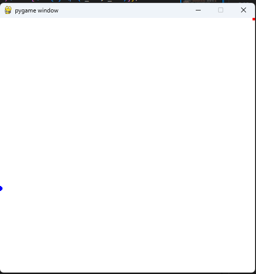
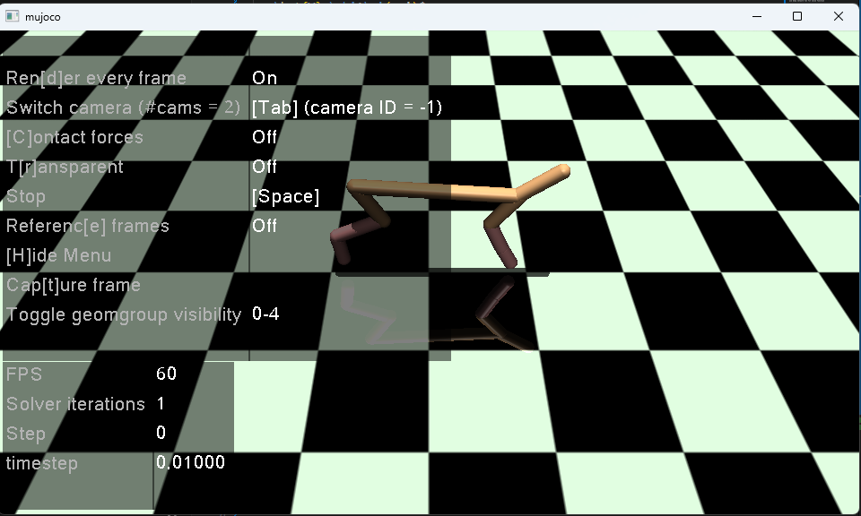
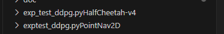
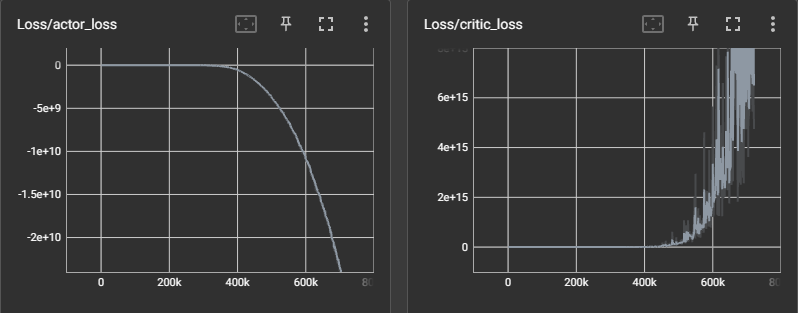
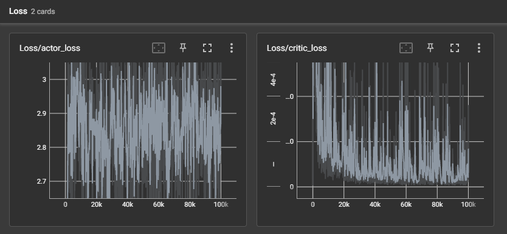
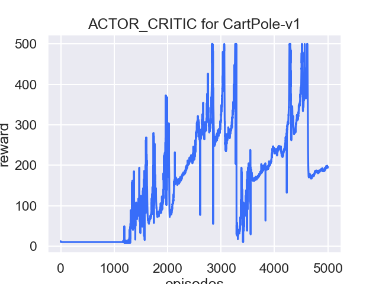

# Homework 2: Implement DDPG on GridMaze2D and HalfCheetah
- 姓名：朱子航
- 学号：522022150087
- 邮箱: 522022150087@smail.nju.edu.cn

## Introduction

Implement DDPG Algorithm in Problem 1 and 2
- Problem 1: the point maze navigation, continuous state-action space 
- Problem 2: the MuJoCo HalfCheet, and make the robot run away
- compare the DDPG with Policy Gradient and actor-critic algorithm

### Actor-Critic

#### Improving the Policy Gradient with a Critic 

"reward to go": $\hat{Q}^\pi_{t,i}=\hat{Q}^\pi (s_t^i, a_t^i)=\sum\limits_{t'=t}\limits^{T}(\gamma^{t'-t}r(s_{t'}^i, a_{t'}^i))$, the estimation of the expectation of reward to have if we take action $a_t^i$ at state $s_t^i$

improving the policy gradient

$\nabla_{\theta}J(\theta) \approx \frac{1}{N}\sum\limits_{i=1}\limits^{N}\sum\limits_{t=0}\limits^{T}\nabla_{\theta}\log{\pi_{\theta}(a_t^i|s_t^i)\cdot \hat{Q}_{t,i}^\pi}$

suppose there is a baseline

$\nabla_\theta J(\theta)\approx \frac{1}{N}\nabla_\theta \log{\pi_{\theta}}(\tau)[r(\tau)-b]$

$b = \frac{1}{N}\sum\limits_{i=1}\limits^{N} r(\tau)$

because the expectation of baseline is 0

- an unbiased expectation
- average reward is not best baseline, but it is good enough

REVIEW: Relationship between Q and V

the state value function is the baseline

$\nabla_{\theta}J(\theta) \approx \frac{1}{N}\sum\limits_{i=1}\limits^{N}\sum\limits_{t=0}\limits^{T}\nabla_{\theta}\log{\pi_{\theta}(a_t^i|s_t^i)\cdot [{Q}^\pi(s_t^i,a_t^i)^\pi-V^\pi(s_t^i)]}$

the advantage function $A^\pi(s_t^i,a_t^i) = {Q}^\pi(s_t^i,a_t^i)^\pi-V^\pi(s_t^i)$

use deep network ton fit value function

modified DRL: $\nabla_{\theta}J(\theta) \approx \frac{1}{N}\sum\limits_{i=1}\limits^{N}\sum\limits_{t=0}\limits^{T}\nabla_{\theta}\log{\pi_{\theta}(a_t^i|s_t^i)\cdot [\hat{A}^\pi(s_t^i,a_t^i)]}$


#### Actor-Critic Algorithm

- Batch Actor Critic Algorithm, Loop:
  - sample $\{s_i,a_i,r_i,s_i'\}$ from $\pi_{\theta}(a|s)$
  - policy evaluation: fit $\hat{V}_{\phi}^\pi(s)$ to samples using supervised regression --- critic
  - evaluate: $\hat{A}^\pi (s_i,a_i)=r_i+\gamma \hat{V}_{\phi}^{\pi}(s_i')-\hat{V}_\phi^\pi(s_i)$
  - policy improvement:  $\nabla_{\theta}J(\theta) \approx \frac{1}{N}\sum\limits_{i=1}\limits^{N}\sum\limits_{t=0}\limits^{T}\nabla_{\theta}\log{\pi_{\theta}(a_t^i|s_t^i)\cdot [\hat{A}^\pi(s_t^i,a_t^i)]}$ -- actor
  - advection: $\theta \leftarrow \theta + \alpha \nabla_\theta J(\theta)$
- Online Actor Critic Algorithm, Loop:

## Appling Q-Learning to Deep Paradigm

### The Replay Buffer

```py
class Replay_buffer():
    '''
    Code based on:
    https://github.com/openai/baselines/blob/master/baselines/deepq/replay_buffer.py
    Expects tuples of (state, next_state, action, reward, done)
    '''
    def __init__(self, max_size=capacity):
        self.storage = []
        self.max_size = max_size
        self.ptr = 0

    def push(self, data):
        if len(self.storage) == self.max_size:
            self.storage[int(self.ptr)] = data
            self.ptr = (self.ptr + 1) % self.max_size
        else:
            self.storage.append(data)

    def sample(self, batch_size):
        ind = np.random.randint(0, len(self.storage), size=batch_size)
        x, y, u, r, d = [], [], [], [], []

        for i in ind:
            X, Y, U, R, D = self.storage[i]
            x.append(np.array(X, copy=False))
            y.append(np.array(Y, copy=False))
            u.append(np.array(U, copy=False))
            r.append(np.array(R, copy=False))
            d.append(np.array(D, copy=False))

        return np.array(x), np.array(y), np.array(u), np.array(r).reshape(-1, 1), np.array(d).reshape(-1, 1)
```


We will use replay buffer to store our testing episodes and then use this database to train Q-learning.

### DDPG

The update phase
- forloop update_iteration(hparams)
  - get {state, action, next_state, done, reward} from replay buffer 
  - compute the target Q value: $Net_{critic_t}(s_{next}, Net_{actor_t}(s_{next}))$
  - get current Q estiamte
  - compute ciritc loss : mse_loss(current_Q, target_Q) 
  - optimize critic (backward)
  - compute actor loss: $\mathcal{L}_{actor}=-Net_{critic}(s, Net_{actor}(s))$
  - optimize the actor (backward)
  - batch update 

## Scene

Beside the problem required Maze Point Nav2D and Half-Cheetah, I also test some algorithm on

- CartPole
- Muojoco InvertedPendulem 

### Maze Point Nav2D

- implemented in `scene/grid/point_nav_2d.py`, inherited from `gym.Environment`
- action_space: $[-0.1, 0.1]^2$ the movement of point
- observation:
  - target position: $[-0.5,0.5]^2$
  - agent position: $[-0.5,0.5]^2$




### Half Cheetah

https://gymnasium.farama.org/environments/mujoco/half_cheetah/

This environment is part of the Mujoco envrionmetns which contains general information about the environment

- Action Space: Box(-1.0, 1.0, (6,), float32)
- Observatoion Space Box(-inf, inf, (17,), float64)
- import `gymnasium.make("HalfCheetah-v4")`
- A Cat-Like Robot Real-Time Learning to Run
- 2-dim robot consisting of 9 links and 8 joints connecting them
- goal: apply the torque on the joints to make the cheetah run forward as fast as possible
- reward: the distance, positive for moving forward and negative for moving backward
- the torso and head of the cheetah are fixed
- torque can only be applied on the other 6 joints over the front and back thighs



### Action Space
- dim 6
- 0 torque applied on the back thigh rotor 
- back shin rotor
- back foot rotor
- front thigh rotor
- front shin rotor
- front foot rotor

### Observation Space

positional values of different body parts of the cheetah

- by default, observations to not include x-coordinate of the cheetah's center of mass, it may be included by passing `exclude_current_positions_from_observation=False`, then the observation dim becomes 18
- first 8 are position
- last 9 are velocity
- episode end: truncates when the episode length is greater than 1000

### Rewards

- forward_reward: A reward of moving forward which is measured as `forward_reward_weight * (X-coordinate-before - x-coordinate-after)/dt`
- ctrl_cost: penalising the cheetah if it takes actions that are too large

## Code Framework

our result is served on this public git repository: [https://github.com/sailing-innocent/drl_homework](https://github.com/sailing-innocent/drl_homework)

Just like before, but this time I use `tensorboard` to show the training result other than `matplotlib`, after runing the cases in app/test_ddpg, you will get some file looks like this:


Then use `tensorboard --logdir="exp_test_ddpg.pyHalfCheetah-v4"` or something to see the actor and critic loss changement.

## Result

### [Train] DDPG HalfCheetah




### [Train] DDPG Point Nav 2D 

And Point Nav 2D, but it seems not convergent, I don't have time to debug it.



### [Train] Actor Critic Cartpole

A naive test on cartpole


